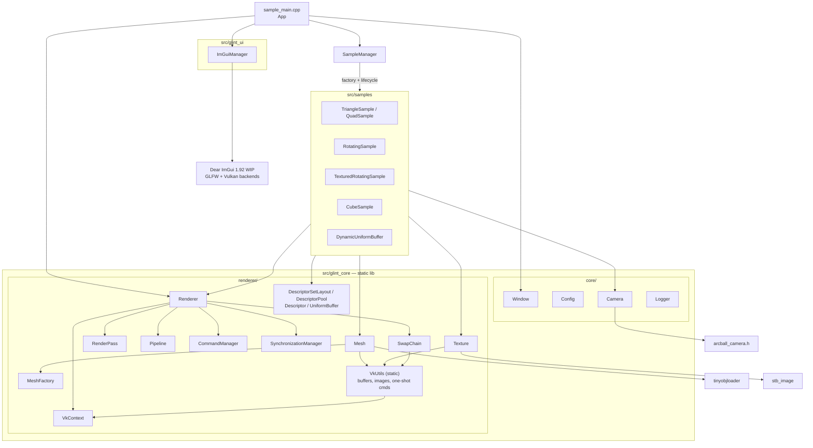
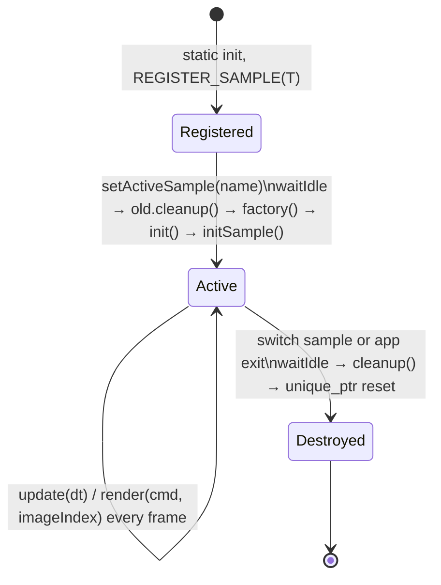

# Architecture

## Layers



- **`glint_core`** is a small engine library, not just helpers. It owns the device, swapchain, render pass,
  frame sync, and the current pipeline. Samples never create a `VkDevice` or `VkRenderPass`. They create
  descriptors, buffers and textures through wrapper classes, and they record draw commands into a command
  buffer that the renderer hands them.
- **`glint_ui`** wraps ImGui initialisation for the renderer's render pass. The ImGui frame
  (`newFrame`) is started in `sample_main.cpp`, and the ImGui draw is recorded by `SampleManager`.
- **Samples** are techniques. Each is a `Sample` subclass with `initSample / update / render / cleanup`.
- **`vks/`** holds code copied from Sascha Willems' samples (a glTF loader, and `VulkanDevice`, which is
  entirely commented out). It isn't wired into anything. `vk_gltf_model.cpp` is excluded from the build
  because it doesn't compile.
- A `VkUtils` static class holds a global `VkContext*` so that `Mesh`, `Texture`, `SwapChain` and
  `UniformBuffer` can allocate memory and run one-shot command buffers without having the context passed in.

Dependencies mostly point downward (samples → core). One exception: `SampleManager::renderSample` calls
`ImGuiManager::render` (samples → ui → core).

## Startup sequence

```mermaid
sequenceDiagram
  participant SI as static init
  participant main
  participant App
  participant R as Renderer
  participant Ctx as VkContext
  participant SM as SampleManager
  SI->>SM: REGISTER_SAMPLE(T) in each .cpp → registerSample(name, factory)
  main->>main: Config::initialize(argc, argv) — env vars, then CLI flags
  main->>App: run()
  App->>App: Window(800×600, "Glint - Samples", GLFW_NO_API, resizable)
  App->>R: Renderer(window, framesInFlight=2).init()
  R->>Ctx: instance (API 1.0) + debug messenger + surface + first suitable GPU + device
  R->>R: VkUtils::init(ctx)
  R->>R: CommandManager (pool; also stored in ctx for one-shot cmds)
  R->>R: SwapChain (images, views, depth image, MSAA colour image)
  R->>R: command buffers ×imageCount, RenderPass, framebuffers, sync objects
  App->>App: ImGuiManager.init (own descriptor pool, GLFW + Vulkan backends, fonts)
  App->>SM: init(window, renderer); setActiveSample("CubeSample")
  SM->>SM: factory() → new sample → init() → initSample() → renderer.createPipeline(config)
```

## Frame loop (`App::mainLoop`)

```
while !(window.shouldClose() || ESC held):
    window.pollEvents()
    dt = now - last                            // high_resolution_clock, seconds
    SampleManager::update(dt)                  // sample writes UBO[currentFrame] (before any fence wait!)
    ImGuiManager::newFrame()
    ImGui "Glint Stats" window (FPS, frame time, active sample)
    renderer.drawFrame(record = SampleManager::render):
        wait fence[imageIndexUsedLastTimeBy(currentFrame)]
        acquire image (signals imageAvailable[currentFrame]); OUT_OF_DATE → handleResize, return
        reset + begin cmd[imageIndex]
          SampleManager::render(cmd, imageIndex):
            ImGui "Sample Selector" combo       // may switch sample right here, mid-recording
            renderPass.begin(framebuffer[imageIndex], clear black, depth 1.0)
            activeSample.render(cmd, imageIndex)
            ImGuiManager::render(cmd)           // ImGui::Render + RenderDrawData
            renderPass.end()
        end cmd
        reset fence[imageIndex]; submit (wait imageAvailable[currentFrame] @ COLOR_ATTACHMENT_OUTPUT,
                                         signal renderFinished[currentFrame], fence[imageIndex])
        present (wait renderFinished[currentFrame]); OUT_OF_DATE / SUBOPTIMAL / resized → handleResize
        currentFrame = (currentFrame + 1) % 2
    renderer.waitIdle()                        // after the loop exits
```

Things to know about this loop:
- **The UBO is written before the fence wait.** `update()` writes `UBO[currentFrame]`, and only then does
  `drawFrame` wait for the fence that protects that frame slot. See
  [known-issues.md](known-issues.md#frame-synchronisation).
- **Sample switching happens inside command-buffer recording.** The ImGui combo is built inside
  `renderSample`. Selecting a sample calls `waitIdle`, destroys the old sample, constructs the new one, and
  replaces the renderer's pipeline, all while the current command buffer is open. It works because nothing
  has been recorded into the pass yet, and the new sample's `render()` runs right after.
- The ImGui frame is open during `update()` and `render()`. Samples read `ImGui::GetIO()` mouse state for the
  camera, so camera input depends on ImGui. They don't check `WantCaptureMouse`, so dragging an ImGui
  window also orbits the camera.
- Present mode: MAILBOX if available, otherwise FIFO. There is no frame cap, and no vsync option.

## Frames in flight vs swapchain images

This is the part of Glint_vk that changed most recently (commit `5371e92`) and it is subtle, so here is the
full mapping:

| Object | Count | Indexed by | Owner |
|---|---|---|---|
| `imageAvailable` semaphore | framesInFlight (2) | `currentFrame` | `SynchronizationManager` |
| `renderFinished` semaphore | framesInFlight (2) | `currentFrame` | `SynchronizationManager` |
| in-flight fence | swapchain image count | `imageIndex` | `SynchronizationManager` |
| primary command buffer | swapchain image count | `imageIndex` | `CommandManager` |
| per-sample UBO + descriptor set | framesInFlight (2) | `currentFrame` | each sample |
| depth image, MSAA colour image | 1 (shared) | — | `SwapChain` |
| framebuffer | swapchain image count | `imageIndex` | `SwapChain` |
| `m_ImageIndices[currentFrame]` | framesInFlight | `currentFrame` | `Renderer`: which image this slot used last, so its fence can be waited on |

Command buffers and fences are per swapchain image so that a recorded buffer can be **reused for the same
image** (caching, see below). The per-frame semaphores and per-frame UBOs keep the usual frames-in-flight
model. Mixing the two indexings is what makes caching and the ImGui fix tricky.

For glint, the plan is the modern layout: per-frame command buffer + fence + acquire semaphore, and one
**present semaphore per swapchain image** (the pattern that recent validation layers require).

## Command buffer caching (`--enable_command_buffer_caching`)

- With the flag, `drawFrame` records `cmd[imageIndex]` only if the buffers are "dirty" or that image hasn't
  been recorded yet. It stops recording once every image's buffer has been recorded.
- Buffers become dirty when `createPipeline` runs (i.e. on sample switch), on resize, and via
  `markCommandBuffersDirty()`.
- **Why it breaks ImGui:** ImGui's draw data (vertex buffers, draw calls) changes every frame and is recorded
  into the same command buffer. The fix noted in commit `2be473a` is a separate per-frame pass for ImGui.
- **A second, quieter problem:** a cached buffer binds the descriptor set of whatever `currentFrame` was
  active at record time. When that image is later acquired in the other frame slot, the sample writes the
  *other* UBO, so the draw uses stale matrices and the UBO it reads may be written while the GPU is using it.
  Caching only works for samples whose per-frame data doesn't change.

Takeaway for glint: re-record every frame (already decided in `glint/docs/PLAN.md` Phase 4). If caching is
ever studied, it deserves its own technique with static geometry and secondary command buffers.

## Sample lifecycle



- Every switch creates a **new instance**, so sample state is not kept (same as Glint_gl).
- `cleanup()` mostly resets `unique_ptr`s in dependency order. The destructors free the Vulkan objects.
  The pipeline is **not** owned by the sample: it stays in the `Renderer` until the next `createPipeline`.
- Registration order across translation units isn't guaranteed (static initialisation order), so the
  order in the combo depends on link order. `"None"` is always first.

## Ownership and lifetimes

| Object | Owner | Lifetime |
|---|---|---|
| `GLFWwindow` | `Window` (`unique_ptr` in `App`) | whole app; the destructor calls `glfwTerminate` |
| `VkInstance`, `VkDevice`, surface, debug messenger | `VkContext` (in `Renderer`) | whole app |
| swapchain, views, framebuffers, depth + MSAA images | `SwapChain` | recreated on resize |
| `VkRenderPass` | `RenderPass` | whole app; not recreated on resize (format assumed stable) |
| current `VkPipeline` + layout | `Renderer::m_Pipeline` | until the next `createPipeline` |
| command pool + buffers | `CommandManager` | whole app; **not** resized if the image count changes |
| semaphores, fences | `SynchronizationManager` | whole app |
| ImGui context + descriptor pool | `ImGuiManager` | whole app |
| descriptors, UBOs, meshes, textures | the active sample | until switch |

Destruction order is the reverse of the `unique_ptr` members' declaration order in `App` and `Renderer`. It
works, but it's implicit: `App` declares `window, renderer, imguiManager`, so ImGui is destroyed first,
then the renderer, then the window.

## Resource creation path

Every upload is **synchronous**:

1. Create a host-visible, coherent staging buffer (`VkUtils::createBuffer`: one `vkAllocateMemory` per buffer).
2. `vkMapMemory` + `memcpy` + `vkUnmapMemory`.
3. Create the device-local destination and run a one-shot command buffer (`beginSingleTimeCommands` /
   `endSingleTimeCommands`) that copies, then `vkQueueWaitIdle`.
4. Free the staging buffer.

Textures go through `UNDEFINED → TRANSFER_DST → (blit chain for mips) → SHADER_READ_ONLY` using
`vkCmdPipelineBarrier` (sync1). Layout transitions only support the three pairs hard-coded in
`VkUtils::transitionImageLayout`.

Uniform buffers are host-visible and coherent, persistently mapped, and updated with `memcpy`.
`DynamicUniformBuffer` uses a non-coherent buffer plus an explicit `vkFlushMappedMemoryRanges`.

## Render pass and pipeline model

- There is one `VkRenderPass`, created once, with 3 attachments: MSAA colour (swapchain format, max sample
  count) → cleared; MSAA depth (D32 or D24S8) → cleared; single-sample resolve target = swapchain image →
  `PRESENT_SRC_KHR`. One subpass, one external dependency.
- **MSAA is always on** at `getMaxUsableSampleCount()`, the highest count the GPU supports for both colour
  and depth. Every pipeline, and ImGui, is created with that sample count.
- `PipelineConfig` controls shaders, vertex format, descriptor set layout (only one), topology, depth
  test/write/compare, cull mode and front face. Blending, polygon mode and push constants are **not**
  exposed. Viewport and scissor are dynamic.
- Winding is CCW, and Y is flipped in the **projection matrix** (`proj[1][1] *= -1` in `Camera`), not with
  a negative viewport.

## Vertex format

One interleaved struct is used by every mesh:

| location | attribute | format |
|---|---|---|
| 0 | position | vec3 |
| 1 | colour | vec3 |
| 2 | texCoord | vec2 |

`VertexAttributeFlags` chooses which attributes the pipeline declares (`POSITION_COLOR`,
`POSITION_TEXCOORD`, `POSITION_COLOR_TEXCOORD`). The stride is always `sizeof(Vertex)`. There are no normals
or tangents, so lighting samples would need a new vertex type. (Glint_gl uses non-interleaved buffers with
normal at location 2, so the location conventions differ. glint should pick one.)

## Paths and resources

- CMake defines `BASE_DIR` (source root) and `SHADER_DIR` (`<build>/bin/shaders`) on `glint_core`.
  `Config::getShaderFile("x.vert")` returns `<SHADER_DIR>/x.vert.spv`, and `getResourceFile(f)` returns
  `<BASE_DIR>/res/f`.
- These can be overridden with `-s`/`-r` or `GLINT_SHADER_PATH`/`GLINT_RESOURCE_PATH`.
- Shaders are compiled at build time, so editing a shader needs a rebuild; there is no hot reload.
- `log.txt` and `imgui.ini` are written to the current working directory. `log.txt` is truncated on every run.

## Logging and error handling

- `Logger` (`core/logger.h`) is header-only. It prints an indented **call trace**: `LOGFN` logs function
  entry and exit, `LOGFN_ONCE` only the first time, and `LOG(...)` stream-concatenates its arguments. It
  writes to stdout and `log.txt`. It is on by default in Debug (`_DEBUG`) and can be toggled with `-l/-L`.
  Defining `GLINT_DISABLE_LOGGING` compiles it out.
- `OneTimeLogger::loggedFunctions` is a static member that **each executable must define** (see the top of
  every `main.cpp`).
- `LOGCALL(x)` logs `#x` and then evaluates `x`. It expands to two statements, so it only works in an `if`
  condition thanks to C++17's if-with-initialiser (`if (LOGCALL(f()) != VK_SUCCESS)`).
- `VK_CHECK_RESULT(f)` (from Sascha's `vk_tools.h`) prints the `VkResult` string and `assert`s, so in
  Release builds a failure is **printed and ignored**.
- The debug messenger reports warnings and errors, both labelled `[VALIDATION ERROR]`.
  If the validation layer isn't installed, the app warns and continues without it.
- Object names are set via `VK_EXT_debug_utils` for swapchain images, depth/MSAA images, and texture
  resources, so they show up in RenderDoc and in validation messages.

## Third-party code (`ext/`)

| Library | Used by | Notes |
|---|---|---|
| Vulkan loader + headers | everything | `find_package(Vulkan)`; API version requested is 1.0 |
| GLFW 3.4 (Windows prebuilt, gitignored) / system GLFW ≥ 3.3 (Linux) | `Window`, ImGui | `GLFW_NO_API` |
| GLM | everywhere | from the Vulkan SDK on Windows; system package or FetchContent on Linux; `GLM_FORCE_RADIANS`, `GLM_FORCE_DEPTH_ZERO_TO_ONE` |
| Dear ImGui 1.92.0 WIP (submodule, master) | `ImGuiManager` | GLFW + Vulkan backends, render-pass mode, not docking |
| stb_image | `Texture` | forced RGBA, **not** flipped, always uploaded as `R8G8B8A8_SRGB` |
| tinyobjloader | `Mesh::loadModel` | used by nothing right now (viking room lines are commented out) |
| arcball_camera.h | `Camera` | same single-header library as Glint_gl |
| ktx (C sources) | nobody yet | built as a static lib for the glTF work |
| tinygltf | `vks/vk_gltf_model` (not built) | header-only |
